# WhiskerAgent 会话链路全流程图

本文档按当前工作区源码梳理一次会话从前端发送、后端调度、Agent 执行、工具调用、事件持久化、SSE 回传到前端展示的完整数据流。文档覆盖 `react` 和 `team` 两种执行模式，并把 event、tool、MCP、Skill、A2A、Trace、沙箱、文件、Redis、PostgreSQL、OSS、UI 投影放到同一条链路里。

源码依据包括：

- 前端：`ui/src/components/chat-input.tsx`、`ui/src/components/session-detail-view.tsx`、`ui/src/hooks/use-session-detail.ts`、`ui/src/lib/api/session.ts`、`ui/src/lib/session-events.ts`、`ui/src/components/tool-preview-panel.tsx`
- API 入口：`api/app/main.py`、`api/app/interfaces/endpoints/session_routes.py`、`api/app/interfaces/schemas/event.py`、`api/app/interfaces/service_dependencies.py`
- 应用服务：`api/app/application/services/agent_service.py`、`api/app/application/services/session_service.py`、`api/app/application/services/app_config_service.py`、`api/app/application/services/skill_service.py`
- 执行核心：`api/app/domain/services/agent_task_runner.py`、`api/app/domain/services/flows/planner_react.py`、`api/app/domain/services/flows/team.py`
- Agent：`api/app/domain/services/agents/base.py`、`planner.py`、`react.py`、`team_planner.py`、`task_worker.py`、`team_synthesizer.py`
- Team DAG：`api/app/domain/services/team/graph.py`、`orchestrator.py`、`policy.py`
- Tool：`api/app/domain/services/tools/*.py`
- Skill：`api/app/domain/services/skills/parser.py`、`registry.py`、`runtime.py`、`api/app/domain/services/tools/skill.py`
- 外部基础设施：`redis_stream_task.py`、`redis_stream_message_queue.py`、`docker_sandbox.py`、`playwright_browser.py`、`openai_llm.py`、`db_uow.py`、`db_session_repository.py`、`db_trace_repository.py`

## 1. 总体心智模型

一次会话有三条同时存在的数据通道：

| 通道             | 主要数据                                                                                    | 方向                                       | 关键文件/函数                                                                                                                   |
| ---------------- | ------------------------------------------------------------------------------------------- | ------------------------------------------ | ------------------------------------------------------------------------------------------------------------------------------- |
| 请求控制通道     | `ChatRequest`、`mode`、附件 id、停止命令                                                    | UI -> API -> AgentService                  | `ChatInput.handleSend()`、`useSessionDetail.sendMessage()`、`sessionApi.chat()`、`session_routes.chat()`、`AgentService.chat()` |
| 执行事件通道     | `MessageEvent`、`PlanEvent`、`ToolEvent`、`TaskGraphEvent`、`TeamTaskEvent`、`DoneEvent` 等 | Runner -> Redis output stream -> SSE -> UI | `AgentTaskRunner._put_and_add_event()`、`EventMapper.event_to_sse_event()`、`useSessionDetail.appendEvent()`                    |
| 资源与副作用通道 | 沙箱文件、Shell、浏览器、搜索结果、MCP/A2A 返回、Skill ZIP、OSS 文件、Trace span            | Agent/Tool <-> 外部系统                    | `BaseAgent._invoke_tool()`、`DockerSandbox`、`PlaywrightBrowser`、`MCPTool`、`A2ATool`、`SkillRuntime`、`TraceRecorder`         |

最高层流程如下：

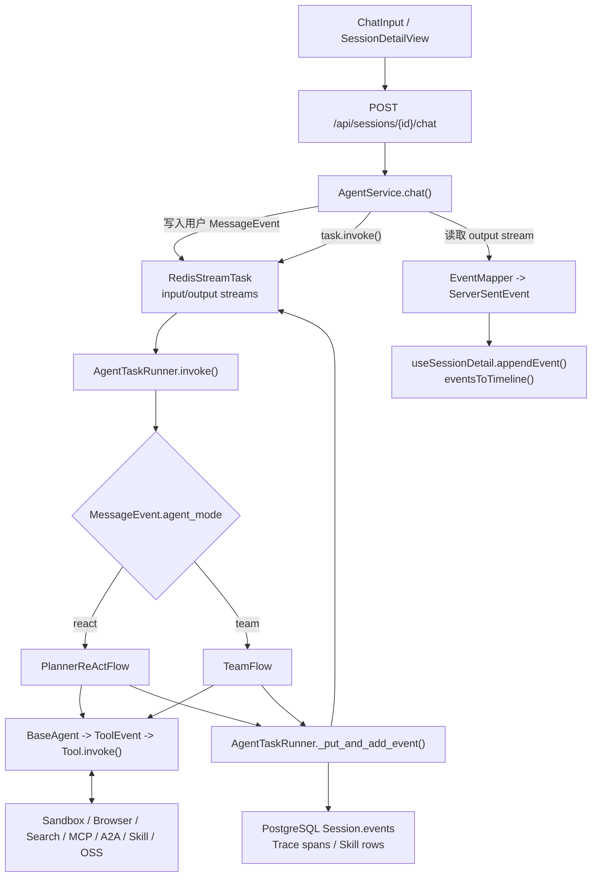
```mermaid
flowchart TD
  UI["ChatInput / SessionDetailView"]
  API["POST /api/sessions/{id}/chat"]
  AS["AgentService.chat()"]
  TASK["RedisStreamTask<br/>input/output streams"]
  RUNNER["AgentTaskRunner.invoke()"]
  MODE{"MessageEvent.agent_mode"}
  REACT["PlannerReActFlow"]
  TEAM["TeamFlow"]
  TOOLS["BaseAgent -> ToolEvent -> Tool.invoke()"]
  EXT["Sandbox / Browser / Search / MCP / A2A / Skill / OSS"]
  EVENT["AgentTaskRunner._put_and_add_event()"]
  DB["PostgreSQL Session.events<br/>Trace spans / Skill rows"]
  SSE["EventMapper -> ServerSentEvent"]
  FE["useSessionDetail.appendEvent()<br/>eventsToTimeline()"]

  UI --> API --> AS
  AS -->|"写入用户 MessageEvent"| TASK
  AS -->|"task.invoke()"| TASK
  TASK --> RUNNER --> MODE
  MODE -->|"react"| REACT
  MODE -->|"team"| TEAM
  REACT --> TOOLS
  TEAM --> TOOLS
  TOOLS <--> EXT
  REACT --> EVENT
  TEAM --> EVENT
  EVENT --> TASK
  EVENT --> DB
  AS -->|"读取 output stream"| SSE --> FE
```

## 2. 启动与依赖注入

FastAPI 启动时先初始化数据库、Redis、OSS，再挂载 `/api` 路由。每次请求通过依赖函数构造服务对象。

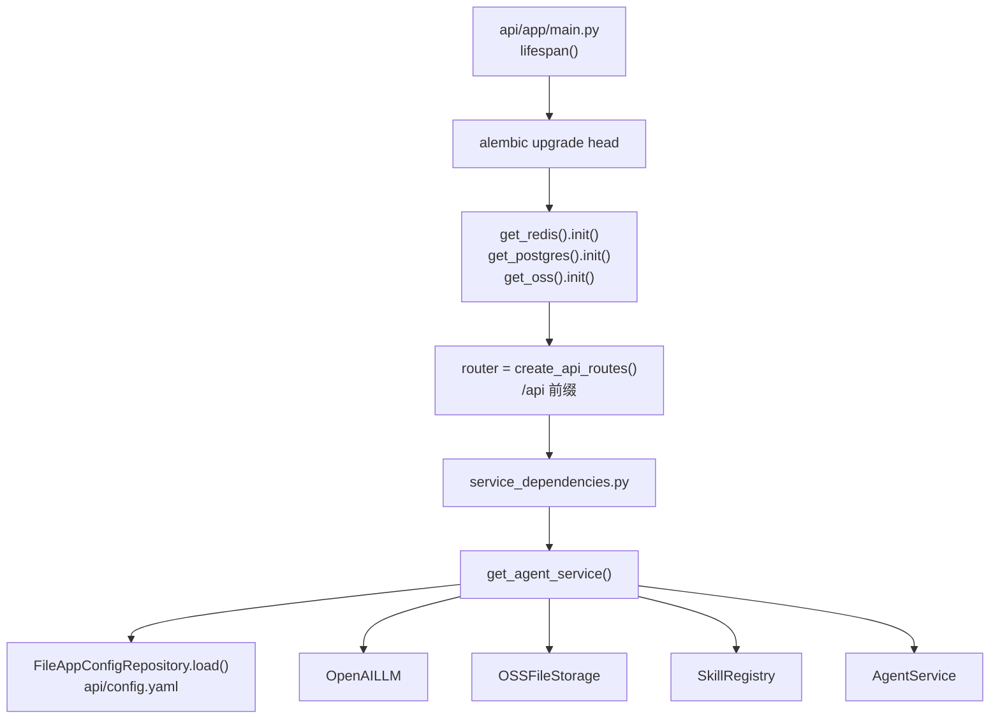
```mermaid
flowchart TD
  MAIN["api/app/main.py<br/>lifespan()"]
  MIGRATE["alembic upgrade head"]
  INIT["get_redis().init()<br/>get_postgres().init()<br/>get_oss().init()"]
  ROUTER["router = create_api_routes()<br/>/api 前缀"]
  DEP["service_dependencies.py"]
  AS["get_agent_service()"]
  CONFIG["FileAppConfigRepository.load()<br/>api/config.yaml"]
  LLM["OpenAILLM"]
  FS["OSSFileStorage"]
  SKILL_REG["SkillRegistry"]
  AGENT_SERVICE["AgentService"]

  MAIN --> MIGRATE --> INIT --> ROUTER
  ROUTER --> DEP --> AS
  AS --> CONFIG
  AS --> LLM
  AS --> FS
  AS --> SKILL_REG
  AS --> AGENT_SERVICE
```

关键依赖创建关系：

| 依赖函数                   | 产物               | 主要下游                                      |
| -------------------------- | ------------------ | --------------------------------------------- |
| `get_agent_service()`      | `AgentService`     | `session_routes.chat()`、`stop_session()`     |
| `get_session_service()`    | `SessionService`   | 创建/删除/读取会话、文件、Shell、VNC          |
| `get_trace_service()`      | `TraceService`     | Trace 面板接口                                |
| `get_skill_registry()`     | `SkillRegistry`    | `SkillService`、`AgentService._create_task()` |
| `get_app_config_service()` | `AppConfigService` | 设置页 LLM/Agent/MCP/A2A 管理接口             |

注意：当前代码在运行时把 `api/config.yaml` 中的 `mcp_config` 和 `a2a_config` 整体传入 `MCPTool.initialize()` / `A2ATool.initialize()`，没有在 `AgentService` 里显式按 `enabled` 过滤。`enabled` 字段在设置接口和列表展示中存在，但运行时过滤需要以当前源码实际行为为准。

## 3. 前端发送、恢复和展示链路

### 3.1 发送消息

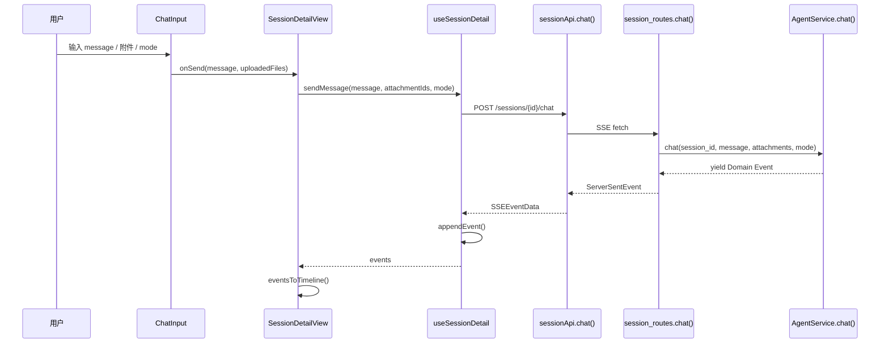
```mermaid
sequenceDiagram
  participant User as 用户
  participant Input as ChatInput
  participant View as SessionDetailView
  participant Hook as useSessionDetail
  participant API as sessionApi.chat()
  participant Route as session_routes.chat()
  participant Service as AgentService.chat()

  User->>Input: 输入 message / 附件 / mode
  Input->>View: onSend(message, uploadedFiles)
  View->>Hook: sendMessage(message, attachmentIds, mode)
  Hook->>API: POST /sessions/{id}/chat
  API->>Route: SSE fetch
  Route->>Service: chat(session_id, message, attachments, mode)
  Service-->>Route: yield Domain Event
  Route-->>API: ServerSentEvent
  API-->>Hook: SSEEventData
  Hook->>Hook: appendEvent()
  Hook-->>View: events
  View->>View: eventsToTimeline()
```

### 3.2 断线恢复和空流监听

`useSessionDetail.refresh()` 会先请求 `GET /sessions/{id}` 和 `GET /sessions/{id}/files`。如果会话不是 completed 且当前没有正在发送的消息，则 `startEmptyStream()` 会调用同一个聊天接口，但不传 `message`，只传 `event_id`。

后端对应行为：

1. `session_routes.chat()` 收到空 message 时仍创建 SSE。
2. `AgentService.chat()` 不写入新的用户事件，也不启动新任务。
3. 它只从当前 task 的 `output_stream.get(start_id=latest_event_id)` 继续读事件。
4. 读到 `DoneEvent`、`ErrorEvent` 或 `WaitEvent` 后结束本次 SSE。

### 3.3 前端事件投影

| 前端函数                        | 输入                                           | 输出/作用                                                          |
| ------------------------------- | ---------------------------------------------- | ------------------------------------------------------------------ |
| `normalizeEvent()`              | 后端 `{ event, data }` 或前端 `{ type, data }` | 统一成 `SSEEventData`                                              |
| `eventsToTimeline()`            | `SSEEventData[]`                               | 对话区 `TimelineItem[]`                                            |
| `getLatestPlanFromEvents()`     | React 的 `plan` 事件                           | 底部 `PlanPanel` 步骤                                              |
| `getLatestTeamPlanFromEvents()` | Team 的 `task_graph/task` 事件                 | 底部 `PlanPanel` 步骤                                              |
| `getToolKind()`                 | `ToolEvent`                                    | 判断展示组件：browser/search/file/bash/mcp/a2a/skill/message       |
| `ToolPreviewPanel`              | 最新/选中的 `ToolEvent`                        | 展示截图、搜索结果、文件内容、Shell 输出、MCP/A2A 结果、Skill 目录 |

Team 工具事件的关键差异是 `ToolEvent.task_id` 不为空。前端会把它归到对应 Team task 的 step 下，而不是归到 React 的当前 plan step。

## 4. API 层与 AgentService

### 4.1 新消息进入后端

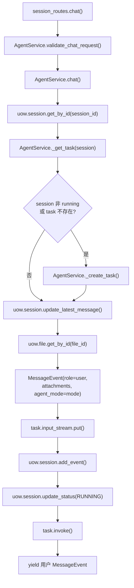
```mermaid
flowchart TD
  ROUTE["session_routes.chat()"]
  VALIDATE["AgentService.validate_chat_request()"]
  CHAT["AgentService.chat()"]
  LOAD_SESSION["uow.session.get_by_id(session_id)"]
  GET_TASK["AgentService._get_task(session)"]
  CREATE_TASK{"session 非 running<br/>或 task 不存在?"}
  NEW_TASK["AgentService._create_task()"]
  UPDATE_MSG["uow.session.update_latest_message()"]
  ATTACH["uow.file.get_by_id(file_id)"]
  USER_EVENT["MessageEvent(role=user,<br/>attachments, agent_mode=mode)"]
  INPUT["task.input_stream.put()"]
  DB_EVENT["uow.session.add_event()"]
  RUNNING["uow.session.update_status(RUNNING)"]
  INVOKE["task.invoke()"]
  ECHO["yield 用户 MessageEvent"]

  ROUTE --> VALIDATE --> CHAT --> LOAD_SESSION --> GET_TASK --> CREATE_TASK
  CREATE_TASK -->|"是"| NEW_TASK
  CREATE_TASK -->|"否"| UPDATE_MSG
  NEW_TASK --> UPDATE_MSG --> ATTACH --> USER_EVENT
  USER_EVENT --> INPUT --> DB_EVENT --> RUNNING --> INVOKE --> ECHO
```

Team 模式下，如果最近一条用户消息是 `agent_mode=team` 且会话仍是 `RUNNING`，`validate_chat_request()` 和 `chat()` 都会拒绝追加新消息，抛出 `ConflictError("Team 运行中不接受新消息；请先停止当前任务")`。

### 4.2 创建 Task 和 Runner

`AgentService._create_task()` 做了运行时资源绑定：

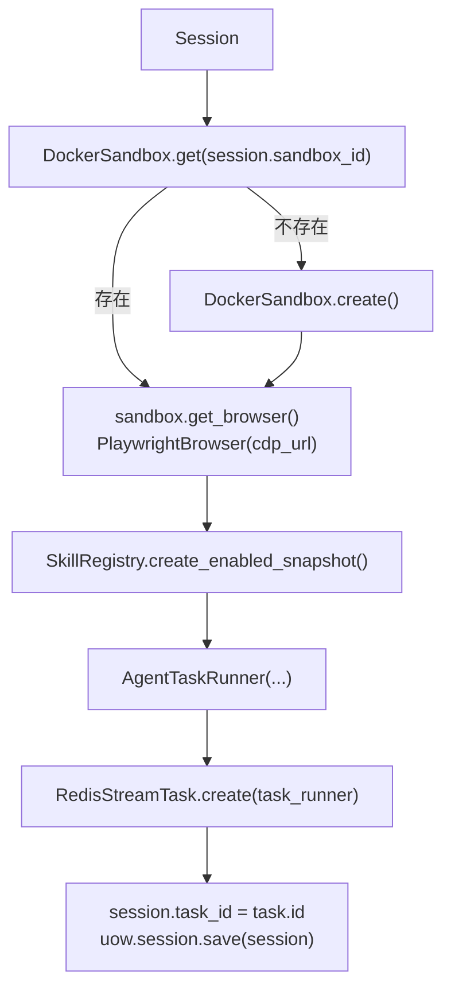
```mermaid
flowchart TD
  SESSION["Session"]
  SANDBOX_GET["DockerSandbox.get(session.sandbox_id)"]
  SANDBOX_CREATE["DockerSandbox.create()"]
  BROWSER["sandbox.get_browser()<br/>PlaywrightBrowser(cdp_url)"]
  SNAPSHOT["SkillRegistry.create_enabled_snapshot()"]
  RUNNER["AgentTaskRunner(...)"]
  TASK["RedisStreamTask.create(task_runner)"]
  SAVE["session.task_id = task.id<br/>uow.session.save(session)"]

  SESSION --> SANDBOX_GET
  SANDBOX_GET -->|"不存在"| SANDBOX_CREATE
  SANDBOX_GET -->|"存在"| BROWSER
  SANDBOX_CREATE --> BROWSER
  BROWSER --> SNAPSHOT --> RUNNER --> TASK --> SAVE
```

Runner 内部持有：

| 字段                 | 来源                                     | 用途                                 |
| -------------------- | ---------------------------------------- | ------------------------------------ |
| `_sandbox`           | `DockerSandbox`                          | 文件/Shell/Skill ZIP 同步            |
| `_browser`           | `PlaywrightBrowser`                      | BrowserTool 和工具截图               |
| `_mcp_tool`          | `MCPTool()`                              | 任务开始时按配置初始化，任务结束清理 |
| `_a2a_tool`          | `A2ATool()`                              | 同上                                 |
| `_skill_runtime`     | `SkillRuntime(skill_snapshots, sandbox)` | 任务级 Skill 目录、ZIP 同步缓存      |
| `_trace_recorder`    | `TraceRecorder(session_id)`              | root/flow/llm/tool/event span        |
| `_react_flow`        | `PlannerReActFlow`                       | 单 Agent 模式复用                    |
| `_team_flow_factory` | `build_team_flow()`                      | Team 每轮消息新建短生命周期 Flow     |

### 4.3 会话相关 API 操作全集

这些接口不一定都参与一次模型推理，但会影响会话生命周期、资源预览或运行时恢复。

| 前端调用                               | 后端接口                                             | 服务/函数                                     | 作用                                |
| -------------------------------------- | ---------------------------------------------------- | --------------------------------------------- | ----------------------------------- |
| `sessionApi.createSession()`           | `POST /api/sessions`                                 | `SessionService.create_session()`             | 创建空白 `Session(title="新对话")`  |
| `sessionApi.getSessions()`             | `GET /api/sessions`                                  | `SessionService.get_all_sessions()`           | 获取会话列表                        |
| `sessionApi.streamSessions()`          | `POST /api/sessions/stream`                          | `SessionService.get_all_sessions()` 循环      | 每 5 秒 SSE 推送会话列表            |
| `sessionApi.getSessionDetail()`        | `GET /api/sessions/{id}`                             | `SessionService.get_session()`                | 读取会话详情和历史事件              |
| `sessionApi.chat()`                    | `POST /api/sessions/{id}/chat`                       | `AgentService.chat()`                         | 新消息、断线恢复、事件 SSE          |
| `sessionApi.stopSession()`             | `POST /api/sessions/{id}/stop`                       | `AgentService.stop_session()`                 | 取消当前 task，持久化取消事件       |
| `sessionApi.deleteSession()`           | `POST /api/sessions/{id}/delete`                     | `SessionService.delete_session()`             | 删除会话记录                        |
| `sessionApi.clearUnreadMessageCount()` | `POST /api/sessions/{id}/clear-unread-message-count` | `SessionService.clear_unread_message_count()` | 清零未读数                          |
| `sessionApi.getSessionFiles()`         | `GET /api/sessions/{id}/files`                       | `SessionService.get_session_files()`          | 读取会话文件列表                    |
| `sessionApi.viewFile()`                | `POST /api/sessions/{id}/file`                       | `SessionService.read_file()`                  | 直接从当前沙箱读取文件内容          |
| `sessionApi.viewShell()`               | `POST /api/sessions/{id}/shell`                      | `SessionService.read_shell_output()`          | 直接读取沙箱 Shell 输出             |
| `VNCOverlay`                           | `WS /api/sessions/{id}/vnc`                          | `SessionService.get_vnc_url()`                | WebSocket 双向转发 noVNC 和沙箱 VNC |
| `sessionApi.getSessionTraces()`        | `GET /api/sessions/{id}/traces`                      | `TraceService.list_traces()`                  | Trace 列表                          |
| `sessionApi.getSessionTraceDetail()`   | `GET /api/sessions/{id}/traces/{trace_id}`           | `TraceService.get_trace()`                    | Trace span 树                       |
| `sessionApi.getSessionTraceMetrics()`  | `GET /api/sessions/{id}/trace-metrics`               | `TraceService.get_metrics()`                  | Trace 指标                          |
| `fileApi.uploadFile()`                 | `POST /api/files`                                    | `FileService.upload_file()`                   | 上传用户附件到 OSS/files 表         |
| `fileApi.getFileInfo()`                | `GET /api/files/{file_id}`                           | `FileService.get_file_info()`                 | 获取文件元数据                      |
| `fileApi.downloadFile()`               | `GET /api/files/{file_id}/download`                  | `FileService.download_file()`                 | 下载 OSS 文件                       |
| 状态页/健康检查                        | `GET /api/status`                                    | `StatusService.check_all()`                   | 检查 Postgres、Redis、OSS 等        |

### 4.4 设置操作对运行链路的影响

| 设置操作             | 接口                             | 存储位置                      | 对后续会话的影响                                       |
| -------------------- | -------------------------------- | ----------------------------- | ------------------------------------------------------ |
| 获取/更新 LLM 配置   | `GET/POST /api/app-config/llm`   | `api/config.yaml`             | 下一次构造 `AgentService` 时创建新的 `OpenAILLM` 参数  |
| 获取/更新 Agent 配置 | `GET/POST /api/app-config/agent` | `api/config.yaml`             | 影响最大迭代、重试、Team 最大任务数/Worker 数/超时等   |
| 新增/删除/启停 MCP   | `/api/app-config/mcp-servers*`   | `api/config.yaml`             | 下一次 Runner 初始化 `MCPTool` 时读取配置并连接 server |
| 新增/删除/启停 A2A   | `/api/app-config/a2a-servers*`   | `api/config.yaml`             | 下一次 Runner 初始化 `A2ATool` 时读取 agent card       |
| 上传/删除/启停 Skill | `/api/app-config/skills*`        | PostgreSQL `skills` + OSS ZIP | 下一次 `_create_task()` 固定启用 Skill 快照            |

运行中 task 已经持有自己的 `AgentTaskRunner`、MCP/A2A 客户端、SkillSnapshot 和 SkillRuntime。设置页后续修改一般只影响后续创建的新 task，不会主动改写当前 Runner 内存对象。

## 5. Redis Task 与 Runner 主循环

`RedisStreamTask` 是任务生命周期壳，`AgentTaskRunner` 才是真正执行者。

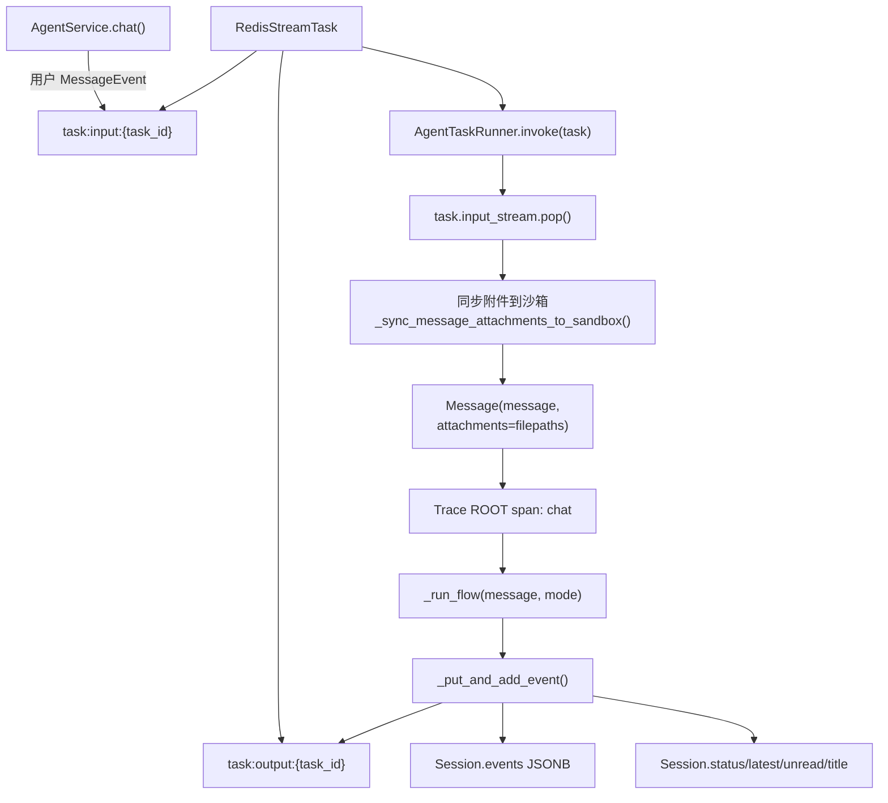
```mermaid
flowchart TD
  TASK["RedisStreamTask"]
  IN["task:input:{task_id}"]
  OUT["task:output:{task_id}"]
  AS["AgentService.chat()"]
  RUNNER["AgentTaskRunner.invoke(task)"]
  POP["task.input_stream.pop()"]
  SYNC_ATTACH["同步附件到沙箱<br/>_sync_message_attachments_to_sandbox()"]
  MSG_OBJ["Message(message,<br/>attachments=filepaths)"]
  ROOT["Trace ROOT span: chat"]
  RUN_FLOW["_run_flow(message, mode)"]
  PUT["_put_and_add_event()"]
  DB["Session.events JSONB"]
  STATUS["Session.status/latest/unread/title"]

  TASK --> IN
  TASK --> OUT
  AS -->|"用户 MessageEvent"| IN
  TASK --> RUNNER --> POP --> SYNC_ATTACH --> MSG_OBJ --> ROOT --> RUN_FLOW
  RUN_FLOW --> PUT
  PUT --> OUT
  PUT --> DB
  PUT --> STATUS
```

Runner 主循环的核心函数调用顺序：

1. `AgentTaskRunner.invoke(task)`
2. `sandbox.ensure_sandbox()`
3. `mcp_tool.initialize(mcp_config)`
4. `a2a_tool.initialize(a2a_config)`
5. `task.input_stream.pop()`
6. 如果是 `MessageEvent`，同步附件到 `/home/ubuntu/upload/{filename}`
7. 开启 root trace span
8. 调用 `_run_flow(message_obj, mode)`
9. 每个 Flow 事件都经过 `_handle_tool_event()` / `_sync_message_attachments_to_storage()`
10. `_put_and_add_event()` 写 Redis output stream、Trace event span、PostgreSQL session events
11. 按事件更新标题、最新消息、未读数、等待状态
12. 输入流为空后更新会话为 `COMPLETED`
13. finally 清理 MCP/A2A 连接

## 6. 领域事件全集

事件定义在 `api/app/domain/models/event.py`，接口层在 `api/app/interfaces/schemas/event.py` 映射为 SSE。

| 事件         | 产生位置                                                            | React                                  | Team                                            | 前端用途                             |
| ------------ | ------------------------------------------------------------------- | -------------------------------------- | ----------------------------------------------- | ------------------------------------ |
| `message`    | `AgentService.chat()`、`PlannerReActFlow`、`ReActAgent`、`TeamFlow` | 用户回显、计划说明、步骤结果、最终总结 | 用户回显、最终总结                              | 对话气泡、附件展示、记录 mode        |
| `title`      | `PlannerReActFlow`、`TeamFlow`                                      | 计划标题                               | DAG 标题                                        | 更新会话标题                         |
| `plan`       | `PlannerAgent.create_plan/update_plan()`、React completed           | 计划创建/更新/完成                     | 不使用                                          | 底部 PlanPanel                       |
| `step`       | `ReActAgent.execute_step()`                                         | Step started/completed/failed          | 不使用                                          | React 对话区 step                    |
| `task_graph` | `TeamFlow.invoke()`、取消/调度结束                                  | 不使用                                 | DAG 完整快照                                    | Team PlanPanel 初始化/刷新           |
| `task`       | `TeamOrchestrator._emit_task()`、`TeamFlow.cancel_events()`         | 不使用                                 | 单任务状态增量                                  | Team 对话区 step 和 PlanPanel 更新   |
| `tool`       | `BaseAgent.invoke()`                                                | 所有工具调用                           | Planner/Synthesizer 的 Skill、Worker 的所有工具 | 工具 badge、工具预览、归属 step/task |
| `wait`       | `ReActAgent` 处理 `message_ask_user`                                | 等待用户继续输入                       | 不直接使用                                      | 会话状态变 waiting，结束 SSE         |
| `error`      | 各层异常处理                                                        | 出错终止                               | 出错终止                                        | 错误消息，会话 completed             |
| `done`       | Flow 正常完成或取消快照后                                           | 正常终止                               | 正常终止                                        | 会话 completed，结束 SSE             |

`ToolEvent` 的通用字段：

| 字段                                | 含义                                                                                |
| ----------------------------------- | ----------------------------------------------------------------------------------- |
| `tool_call_id`                      | LLM tool call id                                                                    |
| `tool_name` / SSE `name`            | 工具箱名，如 `file`、`shell`、`browser`、`search`、`mcp`、`a2a`、`skill`、`message` |
| `function_name` / SSE `function`    | 实际函数名，如 `read_file`、`browser_navigate`、`mcp_x_y`                           |
| `function_args` / SSE `args`        | LLM 生成并经过参数过滤的调用参数                                                    |
| `function_result`                   | `ToolResult`，只在领域事件和数据库中完整保存                                        |
| `tool_content` / SSE `content`      | Runner 为前端生成的摘要内容                                                         |
| `graph_id/task_id/agent_id/attempt` | Team Worker 工具归属，React 中为空                                                  |

## 7. React 模式完整流程

React 模式由 `PlannerReActFlow` 管理：Planner 负责计划，ReAct 负责执行每一步和最终总结。

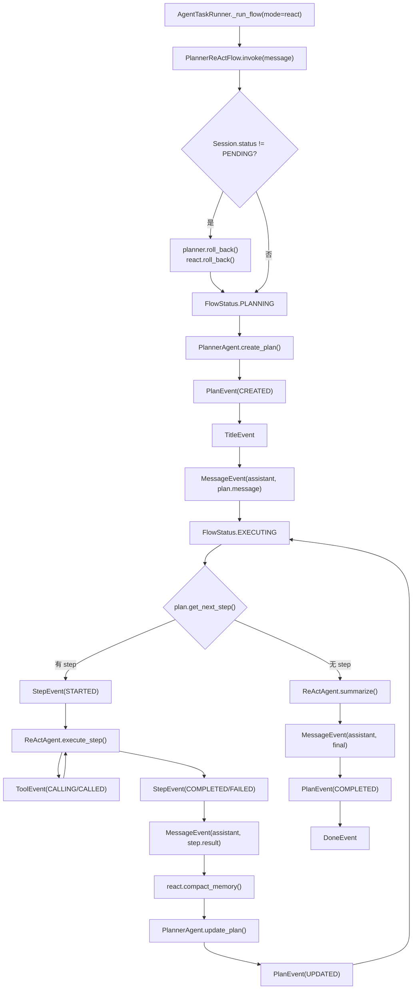
```mermaid
flowchart TD
  START["AgentTaskRunner._run_flow(mode=react)"]
  FLOW["PlannerReActFlow.invoke(message)"]
  ROLLBACK{"Session.status != PENDING?"}
  RB["planner.roll_back()<br/>react.roll_back()"]
  PLANNING["FlowStatus.PLANNING"]
  CREATE["PlannerAgent.create_plan()"]
  PLAN_EVENT["PlanEvent(CREATED)"]
  TITLE["TitleEvent"]
  INTRO["MessageEvent(assistant, plan.message)"]
  EXEC["FlowStatus.EXECUTING"]
  NEXT{"plan.get_next_step()"}
  STEP_START["StepEvent(STARTED)"]
  REACT["ReActAgent.execute_step()"]
  TOOL["ToolEvent(CALLING/CALLED)"]
  STEP_DONE["StepEvent(COMPLETED/FAILED)"]
  STEP_MSG["MessageEvent(assistant, step.result)"]
  COMPACT["react.compact_memory()"]
  UPDATE["PlannerAgent.update_plan()"]
  PLAN_UPDATE["PlanEvent(UPDATED)"]
  SUMMARY["ReActAgent.summarize()"]
  FINAL_MSG["MessageEvent(assistant, final)"]
  PLAN_DONE["PlanEvent(COMPLETED)"]
  DONE["DoneEvent"]

  START --> FLOW --> ROLLBACK
  ROLLBACK -->|"是"| RB --> PLANNING
  ROLLBACK -->|"否"| PLANNING
  PLANNING --> CREATE --> PLAN_EVENT
  PLAN_EVENT --> TITLE --> INTRO --> EXEC
  EXEC --> NEXT
  NEXT -->|"有 step"| STEP_START --> REACT
  REACT --> TOOL --> REACT
  REACT --> STEP_DONE --> STEP_MSG --> COMPACT --> UPDATE --> PLAN_UPDATE --> EXEC
  NEXT -->|"无 step"| SUMMARY --> FINAL_MSG --> PLAN_DONE --> DONE
```

### React 中的 Agent 记忆

`PlannerAgent` 和 `ReActAgent` 默认使用会话持久化 Memory：

- `BaseAgent._ensure_memory()` 从 `uow.session.get_memory(session_id, agent_name)` 读取。
- 第一次调用时插入 system prompt。
- 每次 `_invoke_llm()` 会把用户 prompt、assistant 响应、tool 响应写入 memory。
- `ReActAgent.execute_step()` 每步结束后 `compact_memory()`，避免上下文无限增长。
- 如果会话正在等待或被插入新消息，`roll_back()` 会修正最后一条未完成 tool call。

### React 中的等待用户

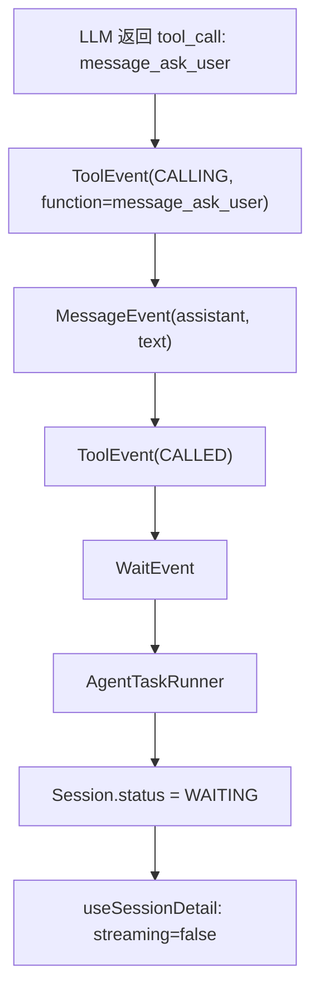
```mermaid
flowchart TD
  LLM["LLM 返回 tool_call: message_ask_user"]
  CALLING["ToolEvent(CALLING, function=message_ask_user)"]
  MSG["MessageEvent(assistant, text)"]
  CALLED["ToolEvent(CALLED)"]
  WAIT["WaitEvent"]
  RUNNER["AgentTaskRunner"]
  DB["Session.status = WAITING"]
  UI["useSessionDetail: streaming=false"]

  LLM --> CALLING --> MSG --> CALLED --> WAIT --> RUNNER --> DB --> UI
```

`message_notify_user` 只返回 `ToolResult(success=True, data="Continue")`，不会触发等待。

## 8. Team 模式完整流程

Team 模式由 `TeamFlow` 管理：Team Planner 产 DAG，Orchestrator 确定性调度 Worker，Synthesizer 汇总结果。

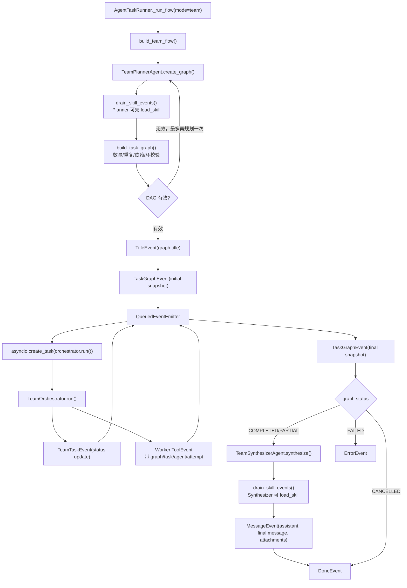
```mermaid
flowchart TD
  START["AgentTaskRunner._run_flow(mode=team)"]
  BUILD["build_team_flow()"]
  PLANNER["TeamPlannerAgent.create_graph()"]
  SKILL_EVENTS1["drain_skill_events()<br/>Planner 可先 load_skill"]
  VALIDATE["build_task_graph()<br/>数量/重复/依赖/环校验"]
  RETRY{"DAG 有效?"}
  TITLE["TitleEvent(graph.title)"]
  GRAPH0["TaskGraphEvent(initial snapshot)"]
  EMITTER["QueuedEventEmitter"]
  PRODUCER["asyncio.create_task(orchestrator.run())"]
  ORCH["TeamOrchestrator.run()"]
  TASK_EVENTS["TeamTaskEvent(status update)"]
  WORKER_TOOLS["Worker ToolEvent<br/>带 graph/task/agent/attempt"]
  GRAPH_DONE["TaskGraphEvent(final snapshot)"]
  STATUS{"graph.status"}
  SYN["TeamSynthesizerAgent.synthesize()"]
  SKILL_EVENTS2["drain_skill_events()<br/>Synthesizer 可 load_skill"]
  FINAL["MessageEvent(assistant, final.message, attachments)"]
  ERROR["ErrorEvent"]
  DONE["DoneEvent"]

  START --> BUILD --> PLANNER --> SKILL_EVENTS1 --> VALIDATE --> RETRY
  RETRY -->|"无效，最多再规划一次"| PLANNER
  RETRY -->|"有效"| TITLE --> GRAPH0 --> EMITTER --> PRODUCER --> ORCH
  ORCH --> TASK_EVENTS --> EMITTER
  ORCH --> WORKER_TOOLS --> EMITTER
  EMITTER --> GRAPH_DONE --> STATUS
  STATUS -->|"COMPLETED/PARTIAL"| SYN --> SKILL_EVENTS2 --> FINAL --> DONE
  STATUS -->|"FAILED"| ERROR
  STATUS -->|"CANCELLED"| DONE
```

### Team DAG 校验

`build_task_graph()` 做确定性校验：

| 校验                                          | 失败原因                             |
| --------------------------------------------- | ------------------------------------ |
| 任务数必须在 `1..agent_config.team_max_tasks` | `task count must be between 1 and N` |
| task id 不重复                                | `duplicate task id`                  |
| 不允许 self dependency                        | `self dependency`                    |
| dependency 不重复                             | `duplicate dependency in task: ...`  |
| dependency 必须存在                           | `unknown dependency: ...`            |
| 不能有环                                      | `cycle detected`                     |

失败后 `TeamFlow` 会把错误放进 `previous_validation_error`，让 Planner 最多重试一次。第二次仍失败则输出 `ErrorEvent("Team Planner 生成无效 DAG: ...")`。

### Team 调度状态机

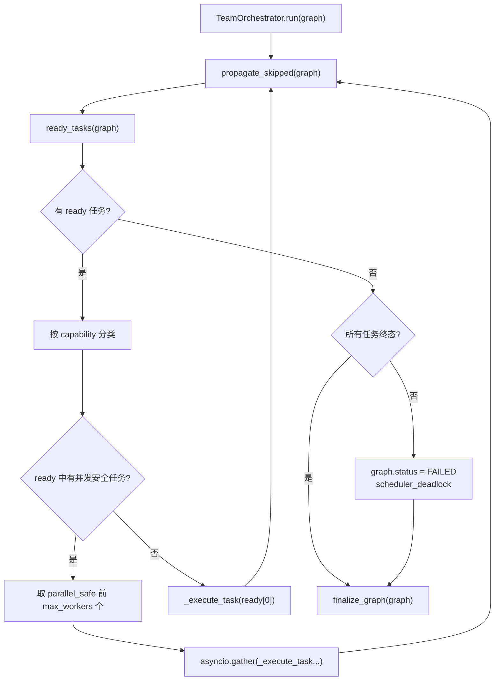
```mermaid
flowchart TD
  RUN["TeamOrchestrator.run(graph)"]
  PROP["propagate_skipped(graph)"]
  READY["ready_tasks(graph)"]
  HAS_READY{"有 ready 任务?"}
  ALL_TERM{"所有任务终态?"}
  DEADLOCK["graph.status = FAILED<br/>scheduler_deadlock"]
  SPLIT["按 capability 分类"]
  PARALLEL{"ready 中有并发安全任务?"}
  BATCH["取 parallel_safe 前 max_workers 个"]
  GATHER["asyncio.gather(_execute_task...)"]
  ONE["_execute_task(ready[0])"]
  FINALIZE["finalize_graph(graph)"]

  RUN --> PROP --> READY --> HAS_READY
  HAS_READY -->|"否"| ALL_TERM
  ALL_TERM -->|"是"| FINALIZE
  ALL_TERM -->|"否"| DEADLOCK --> FINALIZE
  HAS_READY -->|"是"| SPLIT --> PARALLEL
  PARALLEL -->|"是"| BATCH --> GATHER --> PROP
  PARALLEL -->|"否"| ONE --> PROP
```

并发策略来自 `ToolPolicy`：

| `TeamCapability` | 可用工具箱/函数                                                                                       | 是否并发安全 |
| ---------------- | ----------------------------------------------------------------------------------------------------- | ------------ |
| `analysis`       | 无工具，仅 LLM                                                                                        | 是           |
| `search`         | `search.search_web`                                                                                   | 是           |
| `file_read`      | `file.read_file`、`file.search_in_file`、`file.find_files`                                            | 是           |
| `file_write`     | `file.read_file`、`file.search_in_file`、`file.find_files`、`file.write_file`、`file.replace_in_file` | 否           |
| `browser`        | `browser.*`                                                                                           | 否           |
| `shell`          | `shell.*`                                                                                             | 否           |
| `mcp`            | 当前 MCPTool 动态暴露的全部函数                                                                       | 否           |
| `a2a`            | `get_remote_agent_cards`、`call_remote_agent`                                                         | 否           |

如果当前任务快照有 Skill，则 Planner、Worker、Synthesizer 都会额外拿到 `load_skill`。Worker 的 `allowed_tool_names` 会把 `load_skill` 加入白名单。

### Team Worker 执行

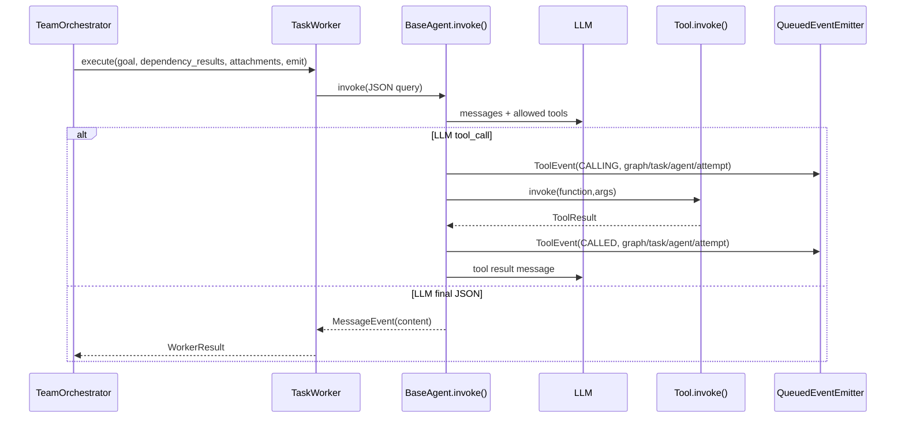
```mermaid
sequenceDiagram
  participant Orch as TeamOrchestrator
  participant Worker as TaskWorker
  participant Agent as BaseAgent.invoke()
  participant LLM as LLM
  participant Tool as Tool.invoke()
  participant Emit as QueuedEventEmitter

  Orch->>Worker: execute(goal, dependency_results, attachments, emit)
  Worker->>Agent: invoke(JSON query)
  Agent->>LLM: messages + allowed tools
  alt LLM tool_call
    Agent->>Emit: ToolEvent(CALLING, graph/task/agent/attempt)
    Agent->>Tool: invoke(function,args)
    Tool-->>Agent: ToolResult
    Agent->>Emit: ToolEvent(CALLED, graph/task/agent/attempt)
    Agent->>LLM: tool result message
  else LLM final JSON
    Agent-->>Worker: MessageEvent(content)
    Worker-->>Orch: WorkerResult
  end
```

Worker 返回 `WorkerResult` 后：

- `success=false` 会被 Orchestrator 当作失败并重试。
- 超时会记录 `task_timeout`。
- 最大重试耗尽后 task 变 `FAILED`。
- 依赖失败的 pending task 会被 `propagate_skipped()` 标成 `SKIPPED`。
- `finalize_graph()` 根据 completed/failed/skipped/cancelled 计算整图状态。

## 9. BaseAgent 到 Tool 的通用调用链

所有 Agent 都继承 `BaseAgent`，工具调用链相同。

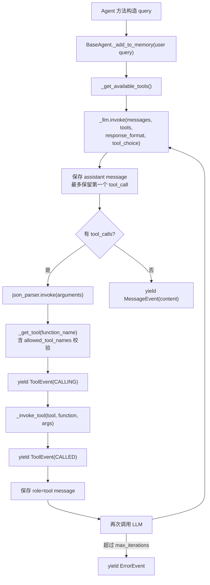
```mermaid
flowchart TD
  PROMPT["Agent 方法构造 query"]
  ADD_USER["BaseAgent._add_to_memory(user query)"]
  SCHEMA["_get_available_tools()"]
  LLM["_llm.invoke(messages, tools,<br/>response_format, tool_choice)"]
  ASSISTANT["保存 assistant message<br/>最多保留第一个 tool_call"]
  HAS_TOOL{"有 tool_calls?"}
  PARSE["json_parser.invoke(arguments)"]
  GET_TOOL["_get_tool(function_name)<br/>含 allowed_tool_names 校验"]
  TE_CALL["yield ToolEvent(CALLING)"]
  INVOKE["_invoke_tool(tool, function, args)"]
  TE_DONE["yield ToolEvent(CALLED)"]
  TOOL_MSG["保存 role=tool message"]
  LOOP["再次调用 LLM"]
  FINAL["yield MessageEvent(content)"]
  ERROR["yield ErrorEvent"]

  PROMPT --> ADD_USER --> SCHEMA --> LLM --> ASSISTANT --> HAS_TOOL
  HAS_TOOL -->|"是"| PARSE --> GET_TOOL --> TE_CALL --> INVOKE --> TE_DONE --> TOOL_MSG --> LOOP --> LLM
  HAS_TOOL -->|"否"| FINAL
  LOOP -->|"超过 max_iterations"| ERROR
```

工具调用失败不会直接抛给 Flow。`_invoke_tool()` 会按 `agent_config.max_retries` 重试，最终返回 `ToolResult(success=False, message=err)`，让 LLM 看到失败结果后决定下一步。

## 10. Tool 全量分支

### 10.1 沙箱文件工具 `FileTool`

文件：`api/app/domain/services/tools/file.py`

| LLM 函数名        | 调用的 Sandbox 方法         | 主要副作用   | Runner 前端增强                                                         |
| ----------------- | --------------------------- | ------------ | ----------------------------------------------------------------------- |
| `read_file`       | `sandbox.read_file()`       | 读取沙箱文件 | `_handle_tool_event()` 再读一次文件内容，写入 `FileToolContent.content` |
| `write_file`      | `sandbox.write_file()`      | 写入沙箱文件 | 如果 args 含 `filepath`，同步该文件到 OSS 并加入 session.files          |
| `replace_in_file` | `sandbox.replace_in_file()` | 修改沙箱文件 | 同上                                                                    |
| `search_in_file`  | `sandbox.search_in_file()`  | 读取/检索    | 同上，如果有 filepath 会同步                                            |
| `find_files`      | `sandbox.find_files()`      | 列目录/查找  | 无文件内容增强                                                          |

沙箱实际 HTTP 端点在 `DockerSandbox` 中：

- `/api/file/read-file`
- `/api/file/write-file`
- `/api/file/replace-in-file`
- `/api/file/search-in-file`
- `/api/file/find-files`
- `/api/file/upload-file`
- `/api/file/download-file`

### 10.2 Shell 工具 `ShellTool`

文件：`api/app/domain/services/tools/shell.py`

| LLM 函数名           | 调用的 Sandbox 方法                                              | 说明                              |
| -------------------- | ---------------------------------------------------------------- | --------------------------------- |
| `shell_execute`      | `sandbox.exec_command(session_id, exec_dir, command)`            | 启动或复用 shell session 执行命令 |
| `shell_read_output`  | `sandbox.read_shell_output(session_id)`                          | 读取输出                          |
| `shell_wait_process` | `sandbox.wait_process(session_id, seconds)`                      | 等待长任务                        |
| `shell_write_input`  | `sandbox.write_shell_input(session_id, input_text, press_enter)` | 交互式输入                        |
| `shell_kill_process` | `sandbox.kill_process(session_id)`                               | 终止进程                          |

Runner 在 `ToolEvent(CALLED)` 后，如果 args 有 `session_id`，会调用 `sandbox.read_shell_output(console=True)`，把 console records 写入 `ShellToolContent.console`，供前端终端预览。

### 10.3 Browser 工具 `BrowserTool`

文件：`api/app/domain/services/tools/browser.py`、`api/app/infrastructure/external/browser/playwright_browser.py`

| LLM 函数名              | PlaywrightBrowser 方法                   | 说明                                   |
| ----------------------- | ---------------------------------------- | -------------------------------------- |
| `browser_view`          | `view_page()`                            | 读取当前页面 markdown 内容和可交互元素 |
| `browser_navigate`      | `navigate(url)`                          | 打开 URL，返回可交互元素               |
| `browser_restart`       | `restart(url)`                           | 清理 Playwright 后重新导航             |
| `browser_click`         | `click(index 或坐标)`                    | 点击元素                               |
| `browser_input`         | `input(text, press_enter, index 或坐标)` | 输入文本                               |
| `browser_move_mouse`    | `move_mouse(x,y)`                        | 移动鼠标                               |
| `browser_press_key`     | `press_key(key)`                         | 按键                                   |
| `browser_select_option` | `select_option(index, option)`           | 下拉选择                               |
| `browser_scroll_up`     | `scroll_up(to_top)`                      | 上滚                                   |
| `browser_scroll_down`   | `scroll_down(to_bottom)`                 | 下滚                                   |
| `browser_console_exec`  | `console_exec(javascript)`               | 执行 JS                                |
| `browser_console_view`  | `console_view(max_lines)`                | 查看 console logs                      |

Runner 在 Browser 工具 `CALLED` 后统一调用 `_get_browser_screenshot()`：

1. `browser.screenshot()`
2. `file_storage.upload_file()` 上传截图到 OSS
3. `get_oss().public_url(file.key)` 生成 URL
4. `ToolEvent.tool_content = BrowserToolContent(screenshot=url)`

前端 `ToolPreviewPanel` 会展示截图，并可打开 VNC 覆盖层。VNC 链路是 `GET session.sandbox_id -> sandbox.vnc_url -> /sessions/{id}/vnc WebSocket -> sandbox ws://ip:5901`。

### 10.4 Search 工具 `SearchTool`

文件：`api/app/domain/services/tools/search.py`

| LLM 函数名   | 下游                                                                    | 说明                 |
| ------------ | ----------------------------------------------------------------------- | -------------------- |
| `search_web` | `SearchEngine.invoke(query, date_range)`，当前注入 `BingSearchEngine()` | 返回 `SearchResults` |

Runner 将结果中的 `results` 写入 `SearchToolContent.results`，前端搜索预览展示 URL、标题、摘要。

### 10.5 Message 工具 `MessageTool`

文件：`api/app/domain/services/tools/message.py`

| LLM 函数名            | 作用                     | 事件行为                                                                                     |
| --------------------- | ------------------------ | -------------------------------------------------------------------------------------------- |
| `message_notify_user` | 给用户展示无需回复的消息 | 普通 ToolEvent，结果为 `"Continue"`                                                          |
| `message_ask_user`    | 向用户提问并等待回复     | `ReActAgent` 拦截：CALLING 时额外产生 assistant MessageEvent，CALLED 后产生 WaitEvent 并返回 |

### 10.6 MCP 工具 `MCPTool`

文件：`api/app/domain/services/tools/mcp.py`

MCP 工具是动态工具集，不使用 `@tool` 装饰器。初始化时连接所有配置的 MCP server，读取每个 server 的 `list_tools()`，再转成 OpenAI tool schema。

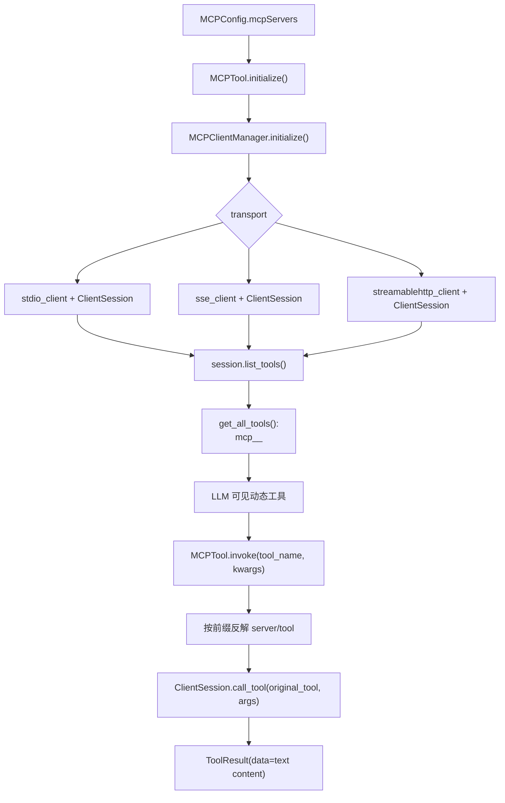
```mermaid
flowchart TD
  CONFIG["MCPConfig.mcpServers"]
  INIT["MCPTool.initialize()"]
  MANAGER["MCPClientManager.initialize()"]
  TRANSPORT{"transport"}
  STDIO["stdio_client + ClientSession"]
  SSE["sse_client + ClientSession"]
  HTTP["streamablehttp_client + ClientSession"]
  LIST["session.list_tools()"]
  SCHEMA["get_all_tools():<br/>mcp_<server>_<tool>"]
  LLM["LLM 可见动态工具"]
  CALL["MCPTool.invoke(tool_name, kwargs)"]
  RESOLVE["按前缀反解 server/tool"]
  SESSION["ClientSession.call_tool(original_tool, args)"]
  RESULT["ToolResult(data=text content)"]

  CONFIG --> INIT --> MANAGER --> TRANSPORT
  TRANSPORT --> STDIO --> LIST
  TRANSPORT --> SSE --> LIST
  TRANSPORT --> HTTP --> LIST
  LIST --> SCHEMA --> LLM --> CALL --> RESOLVE --> SESSION --> RESULT
```

MCP 返回后，Runner 将 `function_result.data` 写入 `MCPToolContent.result`。如果成功但没有 data，会把整个 `ToolResult` 或字符串放入 content。

### 10.7 A2A 工具 `A2ATool`

文件：`api/app/domain/services/tools/a2a.py`

| LLM 函数名               | 作用                      | 下游                           |
| ------------------------ | ------------------------- | ------------------------------ |
| `get_remote_agent_cards` | 获取可调用远程 Agent 列表 | `A2AClientManager.agent_cards` |
| `call_remote_agent`      | 调用远程 Agent            | HTTP JSON-RPC `message/send`   |

初始化流程：

1. `A2ATool.initialize(a2a_config)`
2. `A2AClientManager.initialize()`
3. 创建 `httpx.AsyncClient(timeout=600)`
4. 对每个 `a2a_server.base_url` 请求 `/.well-known/agent-card.json`
5. 以配置中的 `id` 作为 key 缓存 agent card
6. `call_remote_agent(id, query)` 使用 card 中的 `url` 发起 JSON-RPC 请求

Runner 将结果写入 `A2AToolContent.a2a_result`。

### 10.8 Skill 工具 `SkillTool`

Skill 有管理链路和运行链路。

管理链路：

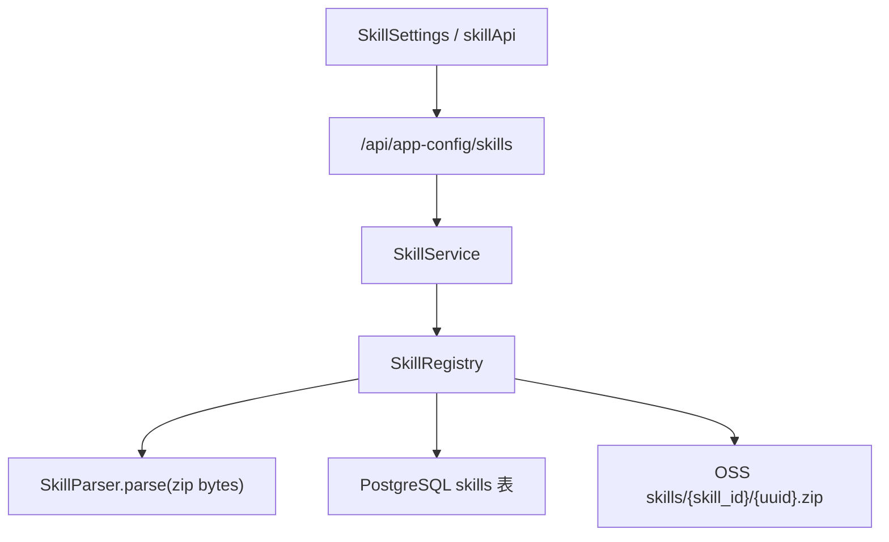
```mermaid
flowchart TD
  UI["SkillSettings / skillApi"]
  ROUTE["/api/app-config/skills"]
  SERVICE["SkillService"]
  REG["SkillRegistry"]
  PARSER["SkillParser.parse(zip bytes)"]
  DB["PostgreSQL skills 表"]
  OSS["OSS skills/{skill_id}/{uuid}.zip"]

  UI --> ROUTE --> SERVICE --> REG
  REG --> PARSER
  REG --> DB
  REG --> OSS
```

运行链路：

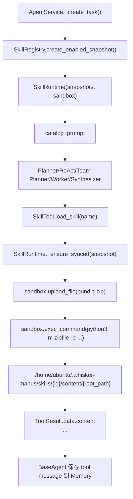
```mermaid
flowchart TD
  CREATE["AgentService._create_task()"]
  SNAP["SkillRegistry.create_enabled_snapshot()"]
  RUNTIME["SkillRuntime(snapshots, sandbox)"]
  CATALOG["catalog_prompt<br/><available_skills>"]
  AGENT["Planner/ReAct/Team Planner/Worker/Synthesizer"]
  LOAD["SkillTool.load_skill(name)"]
  ENSURE["SkillRuntime._ensure_synced(snapshot)"]
  UPLOAD["sandbox.upload_file(bundle.zip)"]
  EXTRACT["sandbox.exec_command(python3 -m zipfile -e ...)"]
  DIR["/home/ubuntu/.whisker-manus/skills/{id}/content/{root_path}"]
  CONTENT["ToolResult.data.content<br/><skill_content>...</skill_content>"]
  MEMORY["BaseAgent 保存 tool message 到 Memory"]

  CREATE --> SNAP --> RUNTIME --> CATALOG --> AGENT --> LOAD --> ENSURE
  ENSURE --> UPLOAD --> EXTRACT --> DIR --> CONTENT --> MEMORY
```

Skill 的关键边界：

- `SkillParser` 只读取 ZIP 中第一个 `SKILL.md`。
- `SKILL.md` 必须有 YAML frontmatter，且包含非空 `name`、`description`。
- `SkillSnapshot` 在 task 创建时固定；后续设置页启停/覆盖不会影响正在跑的 task。
- `SkillRuntime` 缓存沙箱解压目录，跨同一 task 的多个 Agent 复用。
- `SkillTool` 缓存“当前 Agent 是否已加载过此 Skill”，避免同一 Agent 重复注入完整正文。
- 前端只展示 `name` 和 `skill_dir`，不展示完整 `SKILL.md`。

## 11. React 与 Team 的工具可见性对比

| 角色                        | 默认工具                                        | Skill 条件                                                       | 工具限制                       |
| --------------------------- | ----------------------------------------------- | ---------------------------------------------------------------- | ------------------------------ |
| React `PlannerAgent`        | 无工具，`tool_choice="none"`                    | 如果有 catalog，则加入 `SkillTool`，且 BaseAgent 会取消强制 none | 只用于 `load_skill`            |
| React `ReActAgent`          | file、shell、browser、search、message、mcp、a2a | 加入 `SkillTool`                                                 | 无 `allowed_tool_names` 白名单 |
| Team `TeamPlannerAgent`     | 无工具，`tool_choice="none"`                    | 如果有 catalog，则加入 `SkillTool`                               | 只用于 `load_skill`            |
| Team `TaskWorker`           | 按 `TeamCapability` 选择工具                    | 加入 `SkillTool`                                                 | 有 `allowed_tool_names` 白名单 |
| Team `TeamSynthesizerAgent` | 无工具，`tool_choice="none"`                    | 如果有 catalog，则加入 `SkillTool`                               | 只用于 `load_skill`            |

## 12. 文件和附件数据流

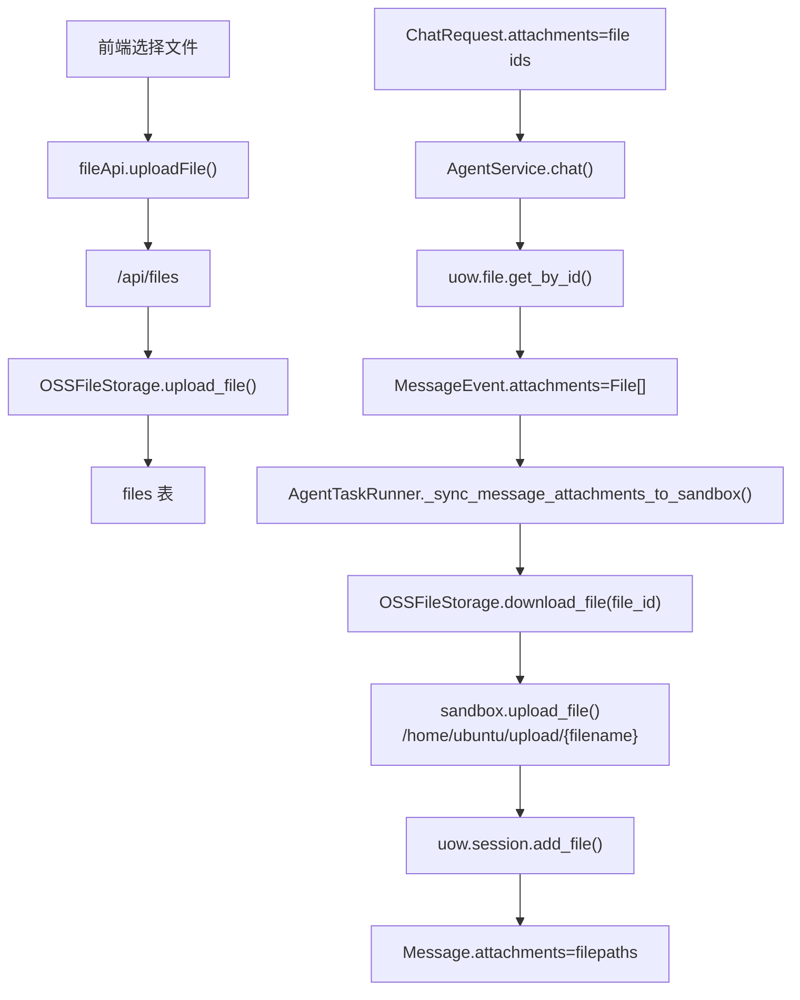
```mermaid
flowchart TD
  UPLOAD["前端选择文件"]
  FILE_API["fileApi.uploadFile()"]
  FILE_ROUTE["/api/files"]
  STORAGE["OSSFileStorage.upload_file()"]
  FILE_DB["files 表"]
  CHAT["ChatRequest.attachments=file ids"]
  AGENT["AgentService.chat()"]
  LOAD_FILE["uow.file.get_by_id()"]
  USER_EVENT["MessageEvent.attachments=File[]"]
  RUNNER["AgentTaskRunner._sync_message_attachments_to_sandbox()"]
  DOWNLOAD["OSSFileStorage.download_file(file_id)"]
  SANDBOX_UPLOAD["sandbox.upload_file()<br/>/home/ubuntu/upload/{filename}"]
  SESSION_FILE["uow.session.add_file()"]
  MSG_OBJ["Message.attachments=filepaths"]

  UPLOAD --> FILE_API --> FILE_ROUTE --> STORAGE --> FILE_DB
  CHAT --> AGENT --> LOAD_FILE --> USER_EVENT --> RUNNER
  RUNNER --> DOWNLOAD --> SANDBOX_UPLOAD --> SESSION_FILE --> MSG_OBJ
```

Agent 生成附件时走反向同步：

1. Agent 最终 `MessageEvent.attachments` 中只有沙箱路径。
2. Runner 调用 `_sync_message_attachments_to_storage()`。
3. `_sync_file_to_storage(filepath)` 从沙箱下载文件。
4. 上传到 OSS，更新/新增 session.files。
5. 将 `MessageEvent.attachments` 替换成带 id/key/filename 的 `File` 对象。

文件工具写入或替换文件后，只要 ToolEvent args 含 `filepath`，Runner 也会尝试把该路径同步到 OSS/session.files，供前端文件列表预览。

## 13. Trace 数据流

Trace 不参与业务决策，是 best-effort 观测链路。

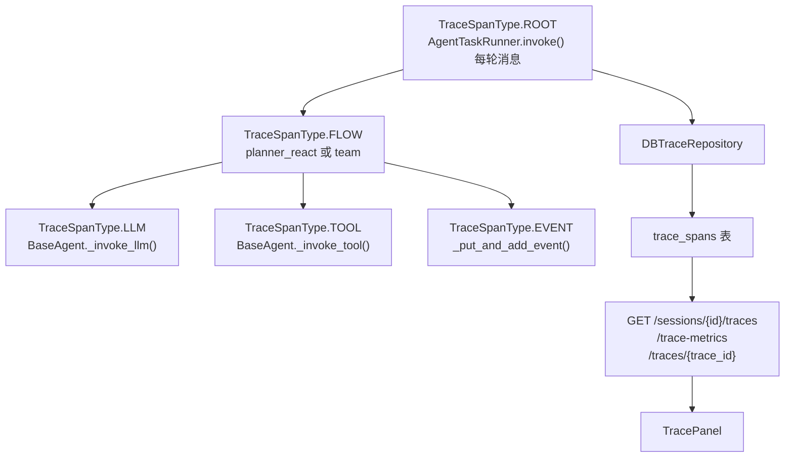
```mermaid
flowchart TD
  ROOT["TraceSpanType.ROOT<br/>AgentTaskRunner.invoke() 每轮消息"]
  FLOW["TraceSpanType.FLOW<br/>planner_react 或 team"]
  LLM["TraceSpanType.LLM<br/>BaseAgent._invoke_llm()"]
  TOOL["TraceSpanType.TOOL<br/>BaseAgent._invoke_tool()"]
  EVENT["TraceSpanType.EVENT<br/>_put_and_add_event()"]
  REPO["DBTraceRepository"]
  DB["trace_spans 表"]
  API["GET /sessions/{id}/traces<br/>/trace-metrics<br/>/traces/{trace_id}"]
  UI["TracePanel"]

  ROOT --> FLOW
  FLOW --> LLM
  FLOW --> TOOL
  FLOW --> EVENT
  ROOT --> REPO --> DB --> API --> UI
```

`TraceRecorder` 使用 contextvar 维护 span 栈。它会脱敏 key 中包含 `api_key/token/password/secret/authorization` 的字段，并对 payload 做 20KB 截断。Trace 写入失败只记录 warning，不中断 Agent 执行。

## 14. 停止、取消和状态收敛

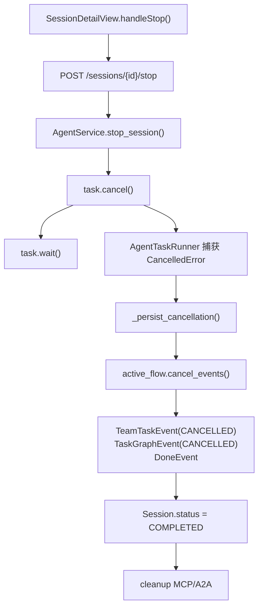
```mermaid
flowchart TD
  UI["SessionDetailView.handleStop()"]
  API["POST /sessions/{id}/stop"]
  SERVICE["AgentService.stop_session()"]
  TASK["task.cancel()"]
  WAIT["task.wait()"]
  RUNNER_CANCEL["AgentTaskRunner 捕获 CancelledError"]
  FLOW_CANCEL["_persist_cancellation()"]
  TEAM_CANCEL["active_flow.cancel_events()"]
  EVENTS["TeamTaskEvent(CANCELLED)<br/>TaskGraphEvent(CANCELLED)<br/>DoneEvent"]
  STATUS["Session.status = COMPLETED"]
  CLEAN["cleanup MCP/A2A"]

  UI --> API --> SERVICE --> TASK --> WAIT
  TASK --> RUNNER_CANCEL --> FLOW_CANCEL --> TEAM_CANCEL --> EVENTS --> STATUS --> CLEAN
```

React Flow 的 `cancel_events()` 默认返回空列表，因此取消时只追加 `DoneEvent`。Team Flow 会把 pending/running/retrying/cancelled 的任务标成 `CANCELLED`，再追加整图 `TaskGraphEvent(CANCELLED)` 和 `DoneEvent`。

## 15. 数据持久化视图

| 数据               | 领域模型         | 存储位置                       | 写入函数                                     |
| ------------------ | ---------------- | ------------------------------ | -------------------------------------------- |
| 会话基础信息       | `Session`        | `sessions` 表                  | `DBSessionRepository.save/update_*()`        |
| 会话事件           | `Event` 判别联合 | `sessions.events` JSONB 数组   | `DBSessionRepository.add_event()`            |
| 会话文件列表       | `File`           | `sessions.files` JSONB 数组    | `DBSessionRepository.add_file/remove_file()` |
| Agent 记忆         | `Memory`         | `sessions.memories` JSONB 对象 | `DBSessionRepository.save_memory()`          |
| 普通上传文件元数据 | `File`           | `files` 表                     | `DBFileRepository`                           |
| 普通上传文件内容   | bytes            | OSS                            | `OSSFileStorage`                             |
| Skill 元数据和正文 | `Skill`          | `skills` 表                    | `DBSkillRepository`                          |
| Skill ZIP          | bytes            | OSS `skills/{id}/{uuid}.zip`   | `OSSSkillBundleStorage`                      |
| Trace span         | `TraceSpan`      | `trace_spans` 表               | `DBTraceRepository`                          |
| Task 输入/输出事件 | JSON 字符串      | Redis Stream                   | `RedisStreamMessageQueue.put/pop/get()`      |

## 16. 函数调用链索引

### 16.1 React 一轮请求

```text
ChatInput.handleSend()
  -> SessionDetailView.handleSend()
  -> useSessionDetail.sendMessage()
  -> sessionApi.chat()
  -> POST /api/sessions/{session_id}/chat
  -> session_routes.chat()
  -> AgentService.validate_chat_request()
  -> AgentService.chat()
     -> AgentService._get_task()
     -> AgentService._create_task() [必要时]
        -> DockerSandbox.get()/create()
        -> sandbox.get_browser()
        -> SkillRegistry.create_enabled_snapshot()
        -> AgentTaskRunner(...)
        -> RedisStreamTask.create()
     -> task.input_stream.put(MessageEvent)
     -> task.invoke()
  -> RedisStreamTask._execute_task()
  -> AgentTaskRunner.invoke()
     -> sandbox.ensure_sandbox()
     -> MCPTool.initialize()
     -> A2ATool.initialize()
     -> task.input_stream.pop()
     -> _sync_message_attachments_to_sandbox()
     -> _run_flow(mode=react)
        -> PlannerReActFlow.invoke()
           -> PlannerAgent.create_plan()
           -> ReActAgent.execute_step()
              -> BaseAgent.invoke()
                 -> _invoke_llm()
                 -> _invoke_tool()
                 -> ToolEvent(CALLING/CALLED)
           -> PlannerAgent.update_plan()
           -> ReActAgent.summarize()
           -> DoneEvent
     -> _put_and_add_event()
  -> AgentService.chat() 读取 output_stream
  -> EventMapper.event_to_sse_event()
  -> useSessionDetail.appendEvent()
  -> eventsToTimeline()
```

### 16.2 Team 一轮请求

```text
ChatInput.handleSend()
  -> ...同 React 至 AgentTaskRunner._run_flow()
  -> _run_flow(mode=team)
     -> build_team_flow()
        -> TeamPlannerAgent(...)
        -> ToolPolicy(...)
        -> TeamOrchestrator(...)
        -> TeamSynthesizerAgent factory
     -> TeamFlow.invoke()
        -> TeamPlannerAgent.create_graph()
           -> BaseAgent.invoke()
           -> [可选] SkillTool.load_skill()
        -> build_task_graph()
        -> TitleEvent
        -> TaskGraphEvent(initial)
        -> TeamOrchestrator.run()
           -> propagate_skipped()
           -> ready_tasks()
           -> _execute_task()
              -> worker_factory()
              -> TaskWorker.execute()
                 -> BaseAgent.invoke()
                 -> ToolEvent(CALLING/CALLED + graph/task/agent/attempt)
              -> TeamTaskEvent(RUNNING/RETRYING/COMPLETED/FAILED)
           -> finalize_graph()
        -> TaskGraphEvent(final)
        -> TeamSynthesizerAgent.synthesize()
           -> [可选] SkillTool.load_skill()
        -> MessageEvent(final)
        -> DoneEvent
  -> ...同 React 的持久化、SSE 和前端投影
```

## 17. React 与 Team 的关键差异

| 维度          | React                                   | Team                                                            |
| ------------- | --------------------------------------- | --------------------------------------------------------------- |
| 入口 mode     | `AgentMode.REACT` 默认值                | 用户显式选择 `AgentMode.TEAM`                                   |
| Flow 生命周期 | Runner 初始化时创建并复用 `_react_flow` | 每轮消息通过 `_team_flow_factory()` 新建                        |
| 任务结构      | `Plan.steps` 顺序步骤                   | `TaskGraph.tasks` DAG                                           |
| 执行者        | 一个 `ReActAgent` 顺序执行              | 多个短生命周期 `TaskWorker` 按 DAG 调度                         |
| 并发          | 无                                      | analysis/search/file_read 可并发，其他串行                      |
| 工具归属      | ToolEvent 归到当前 React step           | ToolEvent 带 `graph_id/task_id/agent_id/attempt`                |
| 计划事件      | `PlanEvent` + `StepEvent`               | `TaskGraphEvent` + `TeamTaskEvent`                              |
| 等待用户      | `message_ask_user` -> `WaitEvent`       | Worker 工具集中没有 `MessageTool`，当前 Team 不直接等待用户澄清 |
| 追加消息      | running 时允许 React roll_back 后继续   | running Team 被拒绝追加，需要先 stop                            |
| 取消快照      | 默认只写 `DoneEvent`                    | 写 cancelled task、cancelled graph、`DoneEvent`                 |
| 最终回答      | `ReActAgent.summarize()`                | `TeamSynthesizerAgent.synthesize()`                             |

## 18. 最完整的数据流闭环

下面这张图把一次会话的主要闭环放在一起：

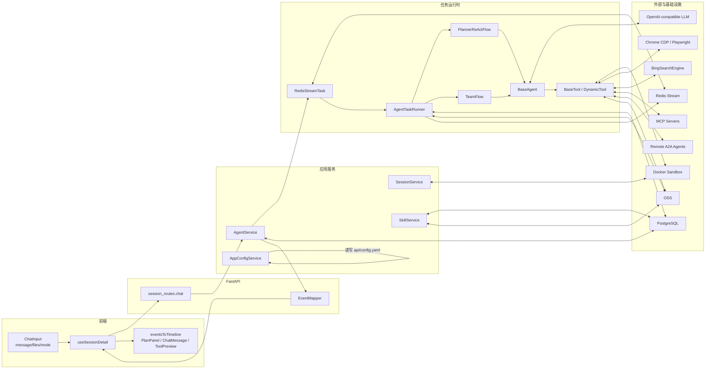
```mermaid
flowchart LR
  subgraph Frontend["前端"]
    INPUT["ChatInput<br/>message/files/mode"]
    HOOK["useSessionDetail"]
    TIMELINE["eventsToTimeline<br/>PlanPanel / ChatMessage / ToolPreview"]
  end

  subgraph API["FastAPI"]
    ROUTE["session_routes.chat"]
    MAPPER["EventMapper"]
  end

  subgraph App["应用服务"]
    AS["AgentService"]
    SS["SessionService"]
    KS["SkillService"]
    CS["AppConfigService"]
  end

  subgraph Runtime["任务运行时"]
    TASK["RedisStreamTask"]
    RUNNER["AgentTaskRunner"]
    REACT["PlannerReActFlow"]
    TEAM["TeamFlow"]
    BASE["BaseAgent"]
    TOOL["BaseTool / DynamicTool"]
  end

  subgraph External["外部与基础设施"]
    REDIS["Redis Stream"]
    PG["PostgreSQL"]
    OSS["OSS"]
    SANDBOX["Docker Sandbox"]
    BROWSER["Chrome CDP / Playwright"]
    SEARCH["BingSearchEngine"]
    MCP["MCP Servers"]
    A2A["Remote A2A Agents"]
    LLM["OpenAI-compatible LLM"]
  end

  INPUT --> HOOK --> ROUTE --> AS --> TASK
  TASK <--> REDIS
  TASK --> RUNNER
  RUNNER --> REACT
  RUNNER --> TEAM
  REACT --> BASE
  TEAM --> BASE
  BASE <--> LLM
  BASE --> TOOL
  TOOL <--> SANDBOX
  TOOL <--> BROWSER
  TOOL <--> SEARCH
  TOOL <--> MCP
  TOOL <--> A2A
  TOOL <--> OSS
  AS <--> PG
  RUNNER <--> PG
  RUNNER <--> OSS
  RUNNER --> REDIS
  AS --> MAPPER --> HOOK --> TIMELINE
  SS <--> SANDBOX
  KS <--> PG
  KS <--> OSS
  CS -->|"读写 api/config.yaml"| CS
```

## 19. 单张总览大图

下面这张图保留所有主要分支，适合把一次会话链路当成一张“地图”看。它把 UI、API、应用服务、Task/Runner、React Flow、Team Flow、Agent 核心、Tool、Skill、MCP、A2A、沙箱、存储、Trace、SSE 回传和前端投影都放在一起。


```mermaid
flowchart TB
  %% =========================
  %% Frontend
  %% =========================
  subgraph FE["前端 Next.js UI"]
    U["用户"]
    CI["ChatInput<br/>输入 message / 附件 / mode"]
    MODE["Agent 模式切换<br/>react / team"]
    FU["fileApi.uploadFile()<br/>上传附件"]
    SDV["SessionDetailView"]
    USD["useSessionDetail"]
    SAPI["sessionApi.chat()<br/>POST SSE"]
    EMPTY["空 body chat<br/>按 event_id 恢复输出流"]
    APPEND["appendEvent()<br/>维护 events[]"]
    NORM["normalizeEvent()<br/>event/type 归一化"]
    TL["eventsToTimeline()"]
    PLANP["PlanPanel<br/>React Plan / Team DAG"]
    CHATUI["ChatMessage<br/>用户/助手/step/tool/error"]
    TOOLPRE["ToolPreviewPanel<br/>browser/search/file/shell/mcp/a2a/skill"]
    TRACEUI["TracePanel"]
    VNCUI["VNCOverlay<br/>noVNC"]
  end

  %% =========================
  %% FastAPI routes
  %% =========================
  subgraph ROUTES["FastAPI /api 路由层"]
    MAIN["main.py lifespan<br/>Alembic / Redis / Postgres / OSS"]
    SR["session_routes.chat()<br/>/sessions/{id}/chat"]
    STOPR["session_routes.stop_session()<br/>/sessions/{id}/stop"]
    SESSR["session_routes<br/>create/list/get/delete/files/file/shell/vnc/traces"]
    FR["file_routes<br/>/files upload/info/download"]
    ACR["app_config_routes<br/>LLM / Agent / MCP / A2A"]
    SKR["skill_routes<br/>/app-config/skills"]
    STATUSR["status_routes<br/>/status"]
    EMAP["EventMapper<br/>Domain Event -> SSE Event"]
  end

  %% =========================
  %% Application services
  %% =========================
  subgraph APP["应用服务层"]
    AS["AgentService"]
    VALID["validate_chat_request()<br/>Team running 拒绝追加消息"]
    CHAT["AgentService.chat()"]
    CTASK["AgentService._create_task()"]
    STOPS["AgentService.stop_session()"]
    SS["SessionService"]
    FSVC["FileService"]
    CSVC["AppConfigService"]
    KSVC["SkillService"]
    TSVC["TraceService"]
  end

  %% =========================
  %% Dependency and config
  %% =========================
  subgraph DEP["依赖与配置"]
    DEPS["service_dependencies.py"]
    CFGREPO["FileAppConfigRepository<br/>api/config.yaml"]
    LLCFG["LLMConfig"]
    AGCFG["AgentConfig<br/>迭代/重试/Team 限制"]
    MCPCFG["MCPConfig"]
    A2ACFG["A2AConfig"]
    UOW["DBUnitOfWork"]
    SKREG["SkillRegistry"]
    SKPARSE["SkillParser<br/>ZIP -> SKILL.md"]
    SKBUNDLE["OSSSkillBundleStorage"]
  end

  %% =========================
  %% Task runtime
  %% =========================
  subgraph RUNTIME["任务运行时"]
    TASK["RedisStreamTask"]
    INQ["task:input:{task_id}<br/>Redis Stream"]
    OUTQ["task:output:{task_id}<br/>Redis Stream"]
    RUNNER["AgentTaskRunner.invoke()"]
    POP["input_stream.pop()<br/>取用户 MessageEvent"]
    ATT2SB["同步附件到沙箱<br/>_sync_message_attachments_to_sandbox()"]
    MSGOBJ["Message<br/>message + attachment filepaths"]
    TRACE["TraceRecorder"]
    ROOTSPAN["ROOT span: chat"]
    FLOWSEL{"MessageEvent.agent_mode"}
    RUNFLOW["_run_flow(message, mode)"]
    HANDLETOOL["_handle_tool_event()<br/>补截图/搜索/文件/Shell/MCP/A2A/Skill content"]
    SYNCOUT["_sync_message_attachments_to_storage()<br/>助手附件回写 OSS"]
    PUT["_put_and_add_event()<br/>写 output stream + DB events + event span"]
    CLEAN["finally cleanup<br/>MCP / A2A"]
  end

  %% =========================
  %% React flow
  %% =========================
  subgraph REACTFLOW["React 单 Agent Flow"]
    PRF["PlannerReActFlow.invoke()"]
    ROLL["planner/react.roll_back()<br/>修正未完成 tool call"]
    PLANNER["PlannerAgent"]
    CREATEPLAN["create_plan()<br/>PlanEvent CREATED"]
    TITLE["TitleEvent"]
    PLANMSG["MessageEvent<br/>plan.message"]
    PLAN["Plan / Step"]
    REACT["ReActAgent"]
    STEPSTART["StepEvent STARTED"]
    EXECSTEP["execute_step()"]
    STEPEND["StepEvent COMPLETED/FAILED"]
    STEPMESSAGE["MessageEvent<br/>step.result"]
    UPDATEPLAN["PlannerAgent.update_plan()<br/>PlanEvent UPDATED"]
    COMPACT["react.compact_memory()"]
    SUM["ReActAgent.summarize()"]
    FINALMSG["MessageEvent<br/>final answer"]
    PLANDONE["PlanEvent COMPLETED"]
    RDONE["DoneEvent"]
    WAIT["message_ask_user<br/>MessageEvent + WaitEvent"]
  end

  %% =========================
  %% Team flow
  %% =========================
  subgraph TEAMFLOW["Team 多 Agent DAG Flow"]
    BTF["build_team_flow()"]
    TF["TeamFlow.invoke()"]
    TPLANNER["TeamPlannerAgent.create_graph()"]
    DRAIN1["drain_skill_events()<br/>Planner load_skill 事件"]
    BTG["build_task_graph()<br/>数量/依赖/环校验"]
    TGE0["TaskGraphEvent<br/>初始 DAG 快照"]
    EMITTER["QueuedEventEmitter"]
    ORCH["TeamOrchestrator.run()"]
    READY["ready_tasks()<br/>依赖完成即可运行"]
    SKIP["propagate_skipped()<br/>依赖失败传播"]
    POLICY["ToolPolicy<br/>按 capability 限工具"]
    PARSAFE{"analysis/search/file_read<br/>可并发?"}
    WORKERS["TaskWorker.execute()<br/>asyncio.gather 或串行"]
    TTE["TeamTaskEvent<br/>running/retrying/completed/failed/skipped"]
    WT["Worker ToolEvent<br/>graph_id/task_id/agent_id/attempt"]
    FINALIZE["finalize_graph()<br/>completed/partial/failed/cancelled"]
    TGE1["TaskGraphEvent<br/>最终 DAG 快照"]
    SYN["TeamSynthesizerAgent.synthesize()"]
    DRAIN2["drain_skill_events()<br/>Synthesizer load_skill 事件"]
    TEAMMSG["MessageEvent<br/>final.message + attachments"]
    TDONE["DoneEvent"]
    TERROR["ErrorEvent<br/>Planner/调度/汇总/整图失败"]
    TCANCEL["cancel_events()<br/>TaskGraph/TeamTask cancelled"]
  end

  %% =========================
  %% Agent core
  %% =========================
  subgraph AGENTCORE["BaseAgent 通用 LLM / Tool 循环"]
    BA["BaseAgent.invoke(query)"]
    MEM["Memory<br/>system/user/assistant/tool"]
    TOOLSCHEMA["_get_available_tools()<br/>OpenAI tool schema"]
    LLMINVOKE["_invoke_llm()"]
    TOOLCALL{"assistant.tool_calls?"}
    JSONP["RepairJSONParser<br/>解析 tool args / JSON output"]
    GETTOOL["_get_tool()<br/>allowed_tool_names 校验"]
    TECALL["ToolEvent CALLING"]
    INVTOOL["_invoke_tool()<br/>重试后返回 ToolResult"]
    TECALLED["ToolEvent CALLED"]
    TOOLMEM["role=tool 写回 Memory"]
    AMESSAGE["MessageEvent<br/>无 tool_call 的最终内容"]
    AERROR["ErrorEvent<br/>max_iterations 或无有效回复"]
  end

  %% =========================
  %% Tools
  %% =========================
  subgraph TOOLS["Tool 工具层"]
    MSGTOOL["MessageTool<br/>message_notify_user / message_ask_user"]
    FILETOOL["FileTool<br/>read/write/replace/search/find"]
    SHELLTOOL["ShellTool<br/>execute/read/wait/input/kill"]
    BROWSERTOOL["BrowserTool<br/>view/navigate/click/input/scroll/console"]
    SEARCHTOOL["SearchTool<br/>search_web"]
    MCPTOOL["MCPTool<br/>动态 mcp_{server}_{tool}"]
    A2ATOOL["A2ATool<br/>get_remote_agent_cards / call_remote_agent"]
    SKILLTOOL["SkillTool<br/>load_skill(name)"]
  end

  %% =========================
  %% Skill runtime
  %% =========================
  subgraph SKILL["Skill 运行时"]
    SNAP["create_enabled_snapshot()<br/>固定任务 SkillSnapshot"]
    SKRT["SkillRuntime<br/>catalog_prompt + 同步缓存"]
    CATALOG["available_skills<br/>注入 system prompt suffix"]
    LOADSK["SkillRuntime.load(name)"]
    ZIPUP["sandbox.upload_file(bundle.zip)"]
    ZIPEX["sandbox.exec_command()<br/>python3 -m zipfile -e"]
    SKDIR["/home/ubuntu/.whisker-manus/skills/{id}/content/{root_path}"]
    SKCONTENT["ToolResult.data.content<br/>完整 SKILL.md + skill_dir"]
  end

  %% =========================
  %% External infrastructure
  %% =========================
  subgraph EXT["外部系统与基础设施"]
    PG["PostgreSQL<br/>sessions/files/skills/trace_spans"]
    REDIS["Redis<br/>input/output stream"]
    OSS["OSS<br/>普通文件 / 截图 / Skill ZIP"]
    DOCKER["DockerSandbox<br/>容器或固定 sandbox_address"]
    SBAPI["Sandbox HTTP API<br/>/api/file /api/shell /api/supervisor"]
    CHROME["Chrome<br/>CDP 9222 / VNC 5901"]
    PW["PlaywrightBrowser"]
    BING["BingSearchEngine"]
    MCPS["MCP Servers<br/>stdio / sse / streamable_http"]
    REMOTEA2A["Remote A2A Agents<br/>agent-card + JSON-RPC message/send"]
    OPENAI["OpenAI-compatible LLM"]
  end

  %% =========================
  %% Persistence and observability
  %% =========================
  subgraph OBS["事件持久化与观测"]
    SESSIONDB["SessionModel<br/>events/files/memories/status/title"]
    TRACEAPI["TraceService<br/>list/detail/metrics"]
    TRACEDB["TraceSpanModel"]
    HEALTH["StatusService<br/>Postgres/Redis/OSS health"]
  end

  %% Frontend to API
  U --> CI
  CI --> MODE
  CI --> FU
  FU --> FR
  FR --> FSVC
  FSVC --> OSS
  FSVC --> PG
  CI --> SDV
  SDV --> USD
  USD --> SAPI
  USD --> EMPTY
  SAPI --> SR
  EMPTY --> SR

  %% API to services
  MAIN --> DEPS
  DEPS --> AS
  DEPS --> SS
  DEPS --> FSVC
  DEPS --> CSVC
  DEPS --> KSVC
  DEPS --> TSVC
  SR --> VALID
  VALID --> CHAT
  CHAT --> AS
  STOPR --> STOPS
  SESSR --> SS
  ACR --> CSVC
  SKR --> KSVC
  STATUSR --> HEALTH

  %% Config and dependencies
  AS --> CFGREPO
  CFGREPO --> LLCFG
  CFGREPO --> AGCFG
  CFGREPO --> MCPCFG
  CFGREPO --> A2ACFG
  AS --> UOW
  UOW --> PG
  KSVC --> SKREG
  SKREG --> SKPARSE
  SKREG --> SKBUNDLE
  SKBUNDLE --> OSS
  CSVC --> CFGREPO

  %% AgentService creates task
  CHAT --> CTASK
  CTASK --> DOCKER
  DOCKER --> SBAPI
  DOCKER --> CHROME
  CTASK --> PW
  CTASK --> SNAP
  SKREG --> SNAP
  SNAP --> SKRT
  CTASK --> RUNNER
  CTASK --> TASK
  TASK --> INQ
  TASK --> OUTQ
  CHAT -->|"用户 MessageEvent"| INQ
  CHAT --> SESSIONDB
  SESSIONDB --> PG
  CHAT -->|"task.invoke()"| TASK

  %% Runner lifecycle
  TASK --> RUNNER
  RUNNER --> DOCKER
  RUNNER --> MCPTOOL
  RUNNER --> A2ATOOL
  MCPCFG --> MCPTOOL
  A2ACFG --> A2ATOOL
  MCPTOOL --> MCPS
  A2ATOOL --> REMOTEA2A
  RUNNER --> POP
  POP --> INQ
  POP --> ATT2SB
  ATT2SB --> OSS
  ATT2SB --> SBAPI
  ATT2SB --> SESSIONDB
  ATT2SB --> MSGOBJ
  MSGOBJ --> ROOTSPAN
  ROOTSPAN --> TRACE
  TRACE --> TRACEDB
  TRACEDB --> PG
  ROOTSPAN --> RUNFLOW
  RUNFLOW --> FLOWSEL

  %% React flow
  FLOWSEL -->|"react"| PRF
  PRF --> ROLL
  ROLL --> PLANNER
  PLANNER --> CREATEPLAN
  CREATEPLAN --> TITLE
  CREATEPLAN --> PLANMSG
  CREATEPLAN --> PLAN
  PLAN --> REACT
  REACT --> STEPSTART
  STEPSTART --> EXECSTEP
  EXECSTEP --> BA
  BA --> TECALL
  BA --> TECALLED
  BA --> AMESSAGE
  EXECSTEP --> STEPEND
  EXECSTEP --> STEPMESSAGE
  STEPEND --> COMPACT
  COMPACT --> UPDATEPLAN
  UPDATEPLAN --> PLAN
  PLAN --> SUM
  SUM --> BA
  SUM --> FINALMSG
  FINALMSG --> PLANDONE
  PLANDONE --> RDONE
  MSGTOOL --> WAIT

  %% Team flow
  FLOWSEL -->|"team"| BTF
  BTF --> TF
  TF --> TPLANNER
  TPLANNER --> BA
  TPLANNER --> DRAIN1
  TPLANNER --> BTG
  BTG --> TGE0
  TGE0 --> EMITTER
  EMITTER --> ORCH
  ORCH --> SKIP
  ORCH --> READY
  READY --> POLICY
  POLICY --> PARSAFE
  PARSAFE --> WORKERS
  WORKERS --> BA
  WORKERS --> WT
  WORKERS --> TTE
  TTE --> EMITTER
  WT --> EMITTER
  ORCH --> FINALIZE
  FINALIZE --> TGE1
  TGE1 --> SYN
  SYN --> BA
  SYN --> DRAIN2
  SYN --> TEAMMSG
  TEAMMSG --> TDONE
  TF --> TERROR
  STOPS --> TCANCEL

  %% BaseAgent core
  BA --> MEM
  BA --> TOOLSCHEMA
  TOOLSCHEMA --> LLMINVOKE
  MEM --> LLMINVOKE
  LLMINVOKE <--> OPENAI
  LLMINVOKE --> TOOLCALL
  TOOLCALL -->|"是"| JSONP
  JSONP --> GETTOOL
  GETTOOL --> TECALL
  TECALL --> INVTOOL
  INVTOOL --> TECALLED
  TECALLED --> TOOLMEM
  TOOLMEM --> MEM
  TOOLMEM --> LLMINVOKE
  TOOLCALL -->|"否"| AMESSAGE
  BA --> AERROR

  %% Tool routing
  INVTOOL --> MSGTOOL
  INVTOOL --> FILETOOL
  INVTOOL --> SHELLTOOL
  INVTOOL --> BROWSERTOOL
  INVTOOL --> SEARCHTOOL
  INVTOOL --> MCPTOOL
  INVTOOL --> A2ATOOL
  INVTOOL --> SKILLTOOL

  FILETOOL --> SBAPI
  SHELLTOOL --> SBAPI
  BROWSERTOOL --> PW
  PW --> CHROME
  SEARCHTOOL --> BING
  MCPTOOL --> MCPS
  A2ATOOL --> REMOTEA2A
  SKILLTOOL --> LOADSK
  SKRT --> CATALOG
  CATALOG --> PLANNER
  CATALOG --> REACT
  CATALOG --> TPLANNER
  CATALOG --> WORKERS
  CATALOG --> SYN
  LOADSK --> SKRT
  LOADSK --> ZIPUP
  ZIPUP --> SBAPI
  ZIPUP --> ZIPEX
  ZIPEX --> SBAPI
  ZIPEX --> SKDIR
  SKDIR --> SKCONTENT
  SKCONTENT --> TOOLMEM

  %% Events back to runner
  TECALL --> HANDLETOOL
  TECALLED --> HANDLETOOL
  TITLE --> PUT
  PLANMSG --> PUT
  CREATEPLAN --> PUT
  STEPSTART --> PUT
  STEPEND --> PUT
  STEPMESSAGE --> PUT
  UPDATEPLAN --> PUT
  FINALMSG --> SYNCOUT
  TEAMMSG --> SYNCOUT
  SYNCOUT --> OSS
  SYNCOUT --> SESSIONDB
  SYNCOUT --> PUT
  WAIT --> PUT
  RDONE --> PUT
  TDONE --> PUT
  TGE0 --> PUT
  TGE1 --> PUT
  TTE --> PUT
  WT --> HANDLETOOL
  TERROR --> PUT
  TCANCEL --> PUT
  AERROR --> PUT
  HANDLETOOL --> PUT
  PUT --> OUTQ
  PUT --> SESSIONDB
  PUT --> TRACE
  OUTQ --> REDIS
  INQ --> REDIS

  %% SSE back to frontend
  CHAT -->|"读取 output_stream.get(event_id)"| OUTQ
  OUTQ --> EMAP
  EMAP -->|"ServerSentEvent"| SAPI
  SAPI --> APPEND
  APPEND --> NORM
  NORM --> TL
  TL --> PLANP
  TL --> CHATUI
  TL --> TOOLPRE

  %% Extra UI panels
  TRACEUI --> TRACEAPI
  TRACEAPI --> TSVC
  TSVC --> TRACEDB
  VNCUI --> SESSR
  SESSR --> DOCKER
  VNCUI <--> CHROME

  %% Stop and cleanup
  SDV -->|"停止"| STOPR
  STOPS --> TASK
  TASK -->|"cancel()"| RUNNER
  RUNNER --> TCANCEL
  RUNNER --> CLEAN
  CLEAN --> MCPTOOL
  CLEAN --> A2ATOOL
```

## 20. 阅读源码时的推荐路径

如果要继续深入调试或改造，建议按这个顺序阅读：

1. `ui/src/hooks/use-session-detail.ts`：理解前端什么时候发新消息、什么时候只恢复事件流。
2. `api/app/application/services/agent_service.py`：理解会话、task、沙箱、用户事件如何创建。
3. `api/app/domain/services/agent_task_runner.py`：理解所有事件如何进入 Redis、DB 和 Trace。
4. `api/app/domain/services/flows/planner_react.py`：理解 React 状态机。
5. `api/app/domain/services/flows/team.py` + `team/orchestrator.py`：理解 Team DAG 状态机。
6. `api/app/domain/services/agents/base.py`：理解 LLM、工具、Memory 的通用循环。
7. `api/app/domain/services/tools/*.py`：理解各工具的函数名和外部副作用。
8. `api/app/interfaces/schemas/event.py` + `ui/src/lib/session-events.ts`：理解后端事件如何变成前端时间线。
